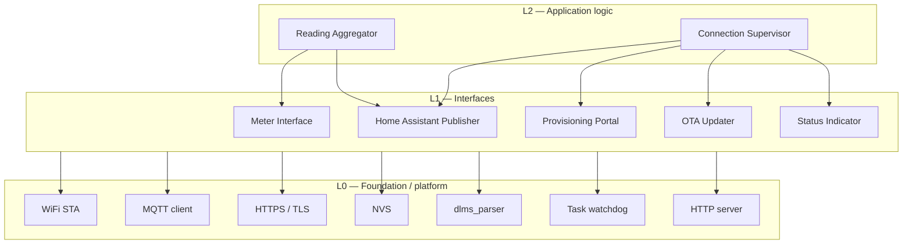

# gPlug-mini — Functional Specification Document (FSD)

```yaml
document_status:            draft
fsd_version:                0.1.0
repository:                 gplug-mini
baseline_commit:            (none — repository not yet created)
applicable_firmware_version: (none — pre-implementation)
author:                     SensorsIot
reviewers:                  —
approval_status:            pending review
created:                    2026-08-03
last_updated:               2026-08-03
change_history:
  - 0.1.0 · 2026-08-03 · initial specification from decisions.md and
    MBUS-E450-Interface-Spec.md
superseded_requirements:    none
open_decisions:
  - OD-1  Meter serial length — 8 or 16 characters (gates FR-MTR-05)
  - OD-2  Does dlms_parser scale values? (gates FR-DEC-03)
  - OD-3  Does dlms_parser assemble bursts across frames? (gates FR-AGG-01)
  - OD-4  Flash size — 4 MB assumed (gates the partition table, Appendix C)
  - OD-5  Licence status of redistributed E450 captures (gates TS-HOST-01)
  - OD-6  WiFi coverage inside the meter cabinet (gates field acceptance)
related_test_baseline:      (none yet)
```

Requirement provenance is tagged `[user]`, `[derived]`, `[pack:esp32]`.
Hardware and protocol facts are **not restated here** — they live in
[`MBUS-E450-Interface-Spec.md`](MBUS-E450-Interface-Spec.md) and are cited by
section. Settled design decisions live in
[`decisions.md`](../decisions.md) and are cited by decision ID.

---

## 1. System Overview

### 1.1 Purpose

gPlug-mini reads a Landis+Gyr E450 electricity meter through its customer
information interface and presents the readings to Home Assistant as native
sensor entities, so household electricity consumption and production appear in
the Home Assistant Energy Dashboard without a cloud service or a utility portal.

### 1.2 Problem statement

The E450 pushes its measurements continuously on a wired interface that no
consumer device understands. The data is available, free, and unread. Reaching it
requires a device that sits permanently in the meter cabinet — a location with no
keyboard, no screen, and no convenient physical access.

### 1.3 Users

| User | Interaction |
|---|---|
| Householder | Sees electricity data in Home Assistant. Never interacts with the device after installation |
| Installer | Mounts the device, provisions it once through a phone browser |
| Maintainer | Issues firmware updates remotely; diagnoses faults without a site visit |

### 1.4 Goals

- Publish E450 measurements to Home Assistant with no manual configuration in
  Home Assistant.
- Survive network, broker and meter outages without intervention.
- Be updatable and diagnosable without opening the meter cabinet.

### 1.5 Non-goals

- Reading the sub-meter channels (gas, water, heat) the E450 relays. They are
  pushed but not decoded — interface spec §6.1.
- Controlling, configuring or writing to the meter. The device is a passive
  listener and never transmits on the meter link — interface spec §1.
- Operating on an encrypted customer interface. A key slot exists; decryption is
  not in this specification — §4.3 below.

### 1.6 System flow

```
E450 ──push──► gPlug-mini ──decode──► measurement set ──MQTT──► Home Assistant
                    │                                              │
                    └── captive portal (provisioning)              └── Energy
                    └── HTTPS pull (firmware update)                   Dashboard
```

---

## 2. System Architecture

### 2.1 Logical architecture

Four concurrent concerns share one MCU:

1. **Meter ingestion** — a receive-only UART accumulating bursts, decoded into a
   measurement set once per meter cycle.
2. **Connection supervision** — a state machine owning WiFi, the broker session,
   the provisioning portal, and the update window.
3. **Publication** — Home Assistant discovery once per session, measurement state
   on every completed cycle.
4. **Supervision** — a watchdog that recovers the device from a hang without
   human presence.

Meter ingestion is independent of network state: the meter is decoded whether or
not anything is listening, and a decoded set with nowhere to go is discarded
(FR-AGG-05).

### 2.2 Hardware / platform architecture

| Element | Value | Source |
|---|---|---|
| MCU | ESP32-C3 on a gPlugM adapter | Interface spec §3 |
| Meter link | UART RX only, GPIO7, 2400 8E1, inverted, no internal pulls | Interface spec §2.2 |
| Indicators | 3 LEDs, active high, GPIO 1 / 3 / 4 | Interface spec §3 |
| Input | 1 button, GPIO9, active low, internal pull-up | Interface spec §3 |
| Power | 5 V from the meter's customer interface | Interface spec §2.1 |
| Network | 2.4 GHz WiFi, station mode; SoftAP during provisioning | D-C3, D-C6 |
| Flash | 4 MB **(assumed — OD-4)** | — |

**Power has an architectural consequence.** The device is energised only while
the meter is. It cannot outlive its data source, cannot report the meter being
unpowered, and starts listening mid-burst on every power cycle — which is why
mid-stream resynchronisation is a normal operating mode rather than an error path
(interface spec §4.1).

**GPIO9 is the ESP32-C3 boot strapping pin.** Held low through reset it forces
serial-download mode, so it is sampled only after boot (FR-PRV-04).

### 2.3 Software architecture

ESP-IDF 6.0.2. The application is C++ — the DLMS library is C++20 (D-D2).

| Concern | Realisation |
|---|---|
| Boot | `app_main` initialises NVS, then the supervisor state machine |
| Concurrency | FreeRTOS tasks: meter ingestion, connection supervision, publication |
| Persistence | NVS, plaintext (D-C2) |
| Update | Dual OTA slots with bootloader rollback (D-U3) |
| Build variants | Production and `-sim`, selected at compile time (D-T2) |

Four ESP-IDF 6 consequences apply and are silent until a build fails:

- `cmake_minimum_required` must be **3.22** or later.
- **cJSON is not bundled.** Home Assistant discovery payloads are JSON, so
  `espressif/cjson` is a required managed component.
- **mDNS is not bundled.** A broker address entered as `homeassistant.local`
  cannot resolve without `espressif/mdns`. See FR-CFG-04.
- Adding `idf_component.yml` to a configured build tree does nothing until the
  build directory is removed or `reconfigure` is run.

`dependencies.lock` is committed; `managed_components/` is not.

### 2.4 Component layering

Strict one-way dependency: each layer depends only on layers below it. The
L0/L1 line is **ownership** — code whose protocol logic this project wrote is an
interface; a library or platform service it merely configures is foundation.



```
┌─ L2 · Application logic ───────────────────────────────────────────
│   Reading Aggregator   ·   Connection Supervisor
│                            ▼ depends on
├─ L1 · Interfaces ─────────────────────────────────────────────────
│   Meter Interface · HA Publisher · Provisioning Portal ·
│   OTA Updater · Status Indicator
│                            ▼ depends on
├─ L0 · Foundation / platform ──────────────────────────────────────
│   WiFi STA · MQTT client · HTTPS/TLS · NVS · dlms_parser ·
│   Task watchdog · HTTP server
└────────────────────────────────────────────────────────────────────
```

**`dlms_parser` is L0, not L1.** It is a third-party library that owns the HDLC
and DLMS protocol logic; this project configures and calls it but neither
implemented nor tests it (D-D1). What *is* owned — UART configuration, feeding
bytes, cycle-boundary detection, and mapping OBIS codes to the measurement model
— is the Meter Interface at L1.

Source-layout rules that make an implementation mirror this layering are HOW, and
belong in the project's Harness, not here.

---

## 3. Implementation Phases

### 3.1 Phase 1 — Decode proven off-hardware

**Scope.** Build `dlms_parser` for the host, run it against published E450
captures, and resolve OD-1, OD-2 and OD-3.

**Deliverables.** Host test suite; the measurement mapping; a CI workflow running
host tests on every push.

**Exit criteria.** Every register in Appendix B decodes from a published capture
with the correct value, unit and scale. OD-1, OD-2 and OD-3 are closed and this
FSD updated where their answers changed a requirement.

**Dependencies.** None. No hardware.

### 3.2 Phase 2 — Device on the bench

**Scope.** Provisioning, WiFi, broker session, HA discovery and state, LED
behaviour, watchdog, the `-sim` build, and OTA including a rollback.

**Deliverables.** Both build variants; the bench test suite; a tagged release.

**Exit criteria.** Every bench-tier verification contract in this document passes
on the Embedded Workbench, and OD-4 is closed by reading the actual flash size.

**Dependencies.** Phase 1. A gPlugM adapter on the bench.

### 3.3 Phase 3 — Cabin

**Scope.** Install at the meter. Confirm the physical layer, real frame decode,
meter-supplied power, and WiFi coverage.

**Deliverables.** A recorded capture from the real meter, kept as a regression
fixture.

**Exit criteria.** The acceptance scenarios in §22.1 pass in situ, and OD-6 is
closed.

**Dependencies.** Phase 2. Physical access, once.

---

## 4. Risks, Assumptions & Dependencies

### 4.1 Risks

| Risk | Likelihood | Impact | Mitigation |
|---|---|---|---|
| WiFi does not reach the meter cabinet | Medium | Blocks deployment entirely | Explicit field test (§22.1). No firmware mitigation exists; the answer is an access point or an external antenna |
| Real frames differ from published captures | Medium | Decoder rework late | Phase 1 closes OD-1..3 first; a real capture becomes a fixture in Phase 3 |
| Meter serial length differs from the assumption | Medium | Decoder finds no blocks and **fails silently** | Treated as a parameter, not a constant (FR-MTR-05); logged as a distinct condition (FR-ERR-03) |
| DSO changes the pushed register set | Low | Entities vanish from Home Assistant | Publish only what is present (FR-HA-05); absence is not an error |
| DSO enables encryption on the interface | Low | Total loss of readings | Key slot provisioned (FR-CFG-03); decryption itself is out of scope |
| Bad firmware reaches the device | Low | Physical visit required | Rollback on failure to reach the broker (FR-OTA-05); manual trigger only (FR-OTA-02) |
| Flash smaller than 4 MB | Low | Partition table will not fit two OTA slots | OD-4 closed before the first flash, which is the last moment it can change |

### 4.2 Assumptions

- Flash is 4 MB *(assumed — OD-4)*.
- The customer interface is unencrypted, as it is for Swiss deployments
  *(assumed from interface spec §4.3)*.
- The Home Assistant MQTT integration is installed and its discovery prefix is
  the default `homeassistant` *(assumed)*.
- Exactly one E450 is read per device *(assumed)*.

### 4.3 Explicitly out of scope

Recorded so a later reader sees a decision rather than an omission.

| Excluded | Reason |
|---|---|
| **Remote log access over MQTT** | Considered and declined. Diagnostics are the LED states of §11 plus the local serial console. Accepted consequence: a fault the LEDs do not describe requires physical access |
| DLMS decryption | No key, no encrypted meter to test against. Implementing a cipher before there is a key to test it with produces untestable code — interface spec §4.3 |
| Sub-meter channels (gas, water, heat) | Pushed by the meter, decoded by nobody here — interface spec §6.1 |
| Offline buffering across broker outages | `total_increasing` lets Home Assistant reconstruct consumption from the next counter value; a gap costs resolution, not correctness (D-H4) |
| Automatic update polling | Delivers a bad build everywhere before anyone notices (D-U2) |
| Flash encryption / encrypted NVS | Irreversible eFuse burning to protect a WiFi password from an attacker already inside the meter cabinet (D-C2) |
| Hardware meter simulator | The decoder is identical whether bytes arrive from a file or a wire; the wire adds only the physical layer, which the field tier confirms (D-T5) |
| Self-hosted CI runner gating on bench tests | The tag carries that meaning instead (D-B3) |
| ESP32-pack test families beyond the curated subset | ~150 cases, most asserting response shape rather than behaviour |

### 4.4 Dependencies

| Dependency | Version | Note |
|---|---|---|
| ESP-IDF | 6.0.2 | D-P4 |
| `esphome/dlms_parser` | ^1.2.0, Apache-2.0 | D-D1. Third-party, not vendor-supported |
| `espressif/cjson` | latest | Not bundled in IDF 6 |
| `espressif/mdns` | latest | Only if `.local` broker addresses are supported — FR-CFG-04 |
| Home Assistant | any with MQTT discovery | External |

---

# Part A — Application Logic (L2)

## 5. Reading Aggregation

### 5.1 Purpose & scope

Turns a stream of decoded DLMS values into one measurement set per meter cycle,
and decides when that set is complete enough to publish.

### 5.2 Requirements

| ID | Priority | Requirement | Provenance |
|---|---|---|---|
| **FR-AGG-01** | Must | The device shall treat a gap of more than 2000 ms between received meter frames as the end of a transmission cycle. | `[user]` D-T2 |
| **FR-AGG-02** | Must | The device shall assemble a single measurement set from all frames received within one cycle. | `[derived]` |
| **FR-AGG-03** | Must | The device shall publish a measurement set exactly once per cycle boundary. | `[derived]` |
| **FR-AGG-04** | Must | When a register appears more than once within one cycle, the device shall retain the first occurrence and discard later ones. | `[user]` interface spec §5.3 |
| **FR-AGG-05** | Must | When no MQTT session is established at a cycle boundary, the device shall discard the measurement set without retaining it. | `[user]` D-H4 |
| **FR-AGG-06** | Must | The device shall discard a measurement set containing no decoded values. | `[derived]` |

### 5.3 Decision logic

```
frame received ──► append payload to cycle buffer, reset gap timer
gap timer > 2000 ms ──► decode buffer
                        ├─ zero values  ──► discard            (FR-AGG-06)
                        ├─ no session   ──► discard            (FR-AGG-05)
                        └─ otherwise    ──► publish, reset     (FR-AGG-03)
```

Publication is not retried and no set is queued. A set that cannot be published
is lost by design (D-H4) — the next cycle supersedes it within seconds, and
energy counters are cumulative, so Home Assistant reconstructs consumption from
whichever counter value arrives next.

### 5.4 Verification contracts

| ID | Precondition · stimulus | Expected observation | Must NOT happen | Tier |
|---|---|---|---|---|
| FR-AGG-01 | Feed two frames separated by 1999 ms, then 2000 ms, then 2001 ms | No boundary at 1999 ms; boundary at 2000 ms and 2001 ms | A boundary fires while frames are still arriving | host |
| FR-AGG-02 | Feed a capture whose OBIS definitions and values fall in different frames | One set containing values from both frames | Values from only the first frame | host |
| FR-AGG-03 | Feed one complete cycle | Exactly one publish call | Two publishes for one cycle | host |
| FR-AGG-04 | Feed a capture with a register in two blocks and differing values | The first value is retained | The later value overwrites the earlier | host |
| FR-AGG-05 | Broker stopped; feed a complete cycle | Set discarded, no queue growth | Memory growth across cycles; replay on reconnect | bench |
| FR-AGG-06 | Feed 20 bytes of noise, then silence | No publish | An empty or all-zero payload published | host |

**FR-AGG-01 depends on OD-3.** If `dlms_parser` performs burst assembly itself,
this requirement becomes a publish-cadence rule rather than a decode trigger, and
its verification moves accordingly. Phase 1 resolves it before implementation.

### 5.5 Constants

| Constant | Value | Rationale |
|---|---|---|
| Cycle gap threshold | 2000 ms | Clear of intra-burst spacing, far below the 5 s shortest push interval — interface spec §4.2 |
| Cycle buffer | 2048 bytes | Sufficient for observed bursts — interface spec §4.2 |

---

## 6. Connection Supervisor

### 6.1 Purpose & scope

Owns the device's operating mode. Every externally visible behaviour that depends
on "what is the device doing right now" derives from this state machine.

### 6.2 Requirements

| ID | Priority | Requirement | Provenance |
|---|---|---|---|
| **FR-SUP-01** | Must | On boot with no stored WiFi credentials, the device shall enter Provisioning. | `[user]` D-C3 |
| **FR-SUP-02** | Must | On boot with stored WiFi credentials, the device shall attempt to connect to the stored network. | `[user]` D-C3 |
| **FR-SUP-03** | Must | On loss of the WiFi association while credentials are stored, the device shall retry connection indefinitely. | `[user]` D-C4 |
| **FR-SUP-04** | Must | The device shall not enter Provisioning as a consequence of failing to connect to a stored network. | `[user]` D-C4 |
| **FR-SUP-05** | Must | Successive reconnection attempts shall use an increasing interval capped at 30 s. | `[derived]` D-C4 |
| **FR-SUP-06** | Must | The device shall enter Provisioning when the button is held for 5 s while running. | `[user]` D-C3 |
| **FR-SUP-07** | Must | The device shall leave Provisioning and resume connecting 300 s after entering it, when no credentials have been submitted. | `[derived]` D-C3 |
| **FR-SUP-08** | Must | The device shall continue decoding meter frames in every state. | `[derived]` |

### 6.3 State model (normative)

States:

| State | Meaning |
|---|---|
| `BOOT` | Initialising; NVS opened, configuration read |
| `PROVISIONING` | SoftAP up, captive portal serving |
| `CONNECTING` | WiFi association in progress or retrying |
| `LINKED` | WiFi associated; no MQTT session |
| `OPERATIONAL` | MQTT session established; publishing |
| `UPDATING` | OTA download in progress |

Transition table — every (state × event) pair is handled, ignored, or excluded:

| From | Event | Guard | To | Action | Limit |
|---|---|---|---|---|---|
| `BOOT` | `init_done` | no credentials | `PROVISIONING` | start SoftAP + portal | — |
| `BOOT` | `init_done` | credentials present | `CONNECTING` | start WiFi STA | — |
| `PROVISIONING` | `creds_saved` | — | `CONNECTING` | persist to NVS, stop AP | — |
| `PROVISIONING` | `portal_timeout` | credentials present | `CONNECTING` | stop AP | 300 s |
| `PROVISIONING` | `portal_timeout` | no credentials | `PROVISIONING` | remain; portal stays up | — |
| `PROVISIONING` | `btn_hold_5s` | — | *(ignored)* | already provisioning | — |
| `CONNECTING` | `wifi_up` | — | `LINKED` | start MQTT client | — |
| `CONNECTING` | `wifi_retry` | — | `CONNECTING` | back off, retry | cap 30 s |
| `CONNECTING` | `btn_hold_5s` | — | `PROVISIONING` | start SoftAP + portal | — |
| `LINKED` | `mqtt_up` | — | `OPERATIONAL` | publish discovery | — |
| `LINKED` | `wifi_down` | — | `CONNECTING` | stop MQTT client | — |
| `LINKED` | `btn_hold_5s` | — | `PROVISIONING` | stop STA, start AP | — |
| `OPERATIONAL` | `mqtt_down` | — | `LINKED` | stop publishing | — |
| `OPERATIONAL` | `wifi_down` | — | `CONNECTING` | stop MQTT client | — |
| `OPERATIONAL` | `ota_cmd` | valid URL | `UPDATING` | begin HTTPS download | — |
| `OPERATIONAL` | `btn_hold_5s` | — | `PROVISIONING` | stop STA, start AP | — |
| `UPDATING` | `ota_ok` | — | *(reboot)* | set boot slot, restart | — |
| `UPDATING` | `ota_fail` | — | `OPERATIONAL` | discard image, log | — |
| `UPDATING` | `wifi_down` | — | `CONNECTING` | abort download, discard | — |
| `UPDATING` | `btn_hold_5s` | — | *(ignored)* | never interrupt a flash write | — |
| *any* | `meter_burst` | — | *(no change)* | ingestion is state-independent | — |

Excluded by construction: `mqtt_up` outside `LINKED` (the client runs only in
`LINKED` and above); `creds_saved` outside `PROVISIONING` (the portal is the only
writer).

### 6.4 Verification contracts

| ID | Precondition · stimulus | Expected observation | Must NOT happen | Tier |
|---|---|---|---|---|
| FR-SUP-01 | Erase NVS, boot | SoftAP appears within 10 s | Device connects to any prior network | bench |
| FR-SUP-02 | Credentials stored, boot | Association attempt to the stored SSID | SoftAP appears | bench |
| FR-SUP-04 | `OPERATIONAL`; power off the access point for 10 min | Device retries throughout | **SoftAP appears at any point** | bench |
| FR-SUP-05 | Deny association repeatedly; log attempt times | Intervals increase, then hold at 30 s ±2 s | Interval exceeds 30 s, or attempts stop | bench |
| FR-SUP-06 | `OPERATIONAL`; hold the button 5 s | SoftAP appears within 5 s | Device reboots; download mode entered | bench |
| FR-SUP-07 | Enter Provisioning with credentials stored; wait 300 s | Returns to `CONNECTING` | Remains in AP mode indefinitely | bench |
| FR-SUP-08 | Broker stopped; feed a cycle | Decode occurs and is logged | Ingestion stops while offline | bench |

Full contract for the requirement that most defines the product:

```yaml
id: FR-SUP-04
verification:
  preconditions:
    - The DUT is in OPERATIONAL with a stored SSID.
    - The workbench access point is serving that SSID.
  stimulus:
    - Disable the access point.
    - Keep it unavailable for 10 minutes.
    - Re-enable it.
  expected_observations:
    - The DUT remains in CONNECTING for the whole outage.
    - No SoftAP is broadcast at any point during the outage.
    - The DUT re-associates and re-establishes MQTT within 60 s of the AP
      returning.
  timing: 60 s from access point availability to MQTT session
  tolerance: +30 s
  prohibited_outcomes:
    - The DUT broadcasts its provisioning SSID.
    - The DUT restarts.
    - Stored credentials are erased.
    - Recovery requires a button press.
  tier: bench
  evidence:
    - Continuous WiFi scan log covering the outage, showing no gPlug SSID.
    - Reset reason after the test.
    - Broker connection log with timestamps.
  cleanup:
    - Restore the access point.
    - Confirm the DUT returns to OPERATIONAL.
```

---

# Part B — Interfaces (L1)

## 7. Meter Interface

### 7.1 Purpose & peer

Receives the E450's push telegrams and converts decoded DLMS values into this
project's measurement model. The peer is the meter, through an external M-Bus
level shifter. Traffic is one-way.

### 7.2 Requirements

| ID | Priority | Requirement | Provenance |
|---|---|---|---|
| **FR-MTR-01** | Must | The device shall configure the meter UART as 2400 baud, 8 data bits, even parity, 1 stop bit. | `[user]` interface spec §2.2 |
| **FR-MTR-02** | Must | The device shall invert the UART receive signal. | `[user]` interface spec §2.2 |
| **FR-MTR-03** | Must | The device shall disable both internal pull-up and pull-down on the meter UART receive pin. | `[user]` interface spec §2.2 |
| **FR-MTR-04** | Must | The device shall never transmit on the meter link. | `[user]` interface spec §1 |
| **FR-MTR-05** | Must | The meter serial length used for block detection shall be a configurable parameter, not a compiled-in constant. | `[derived]` OD-1 |
| **FR-MTR-06** | Must | The device shall recover frame alignment without external assistance when reception begins mid-burst. | `[derived]` interface spec §4.1 |
| **FR-MTR-07** | Must | The device shall discard any frame whose CRC does not validate. | `[user]` interface spec §4.1 |
| **FR-MTR-08** | Must | The device shall not forward any part of a CRC-invalid frame to the decoder. | `[derived]` |
| **FR-MTR-09** | Must | The device shall map decoded OBIS codes to the measurement labels of Appendix B. | `[derived]` D-H2 |
| **NFR-MTR-01** | Must | The receive path shall accommodate a complete burst rather than a single frame. | `[derived]` interface spec §2.2 |

FR-MTR-04 is a safety property, not a convenience: the customer interface is a
metrologically sealed device, and transmitting on it is outside what a consumer
reader is permitted to do.

### 7.3 Protocol

M-Bus electrical layer (EN 13757-2) carrying DLMS/COSEM push telegrams in HDLC
framing, OBIS-addressed. Full detail in interface spec §4 and §5; not restated.

### 7.4 Failure modes

| Condition | Behaviour |
|---|---|
| No bytes received | No publication. The device remains in its network state and reports nothing about the meter |
| Continuous noise, no valid frame | Frames discarded; no publication (FR-AGG-06) |
| CRC failures | Frame discarded (FR-MTR-07); counted for diagnostics (FR-ERR-02) |
| Burst exceeds the buffer | Excess dropped, condition logged; the partial set is still decoded |
| Decoder finds no blocks | Distinct logged condition — the signature of a wrong serial length (FR-ERR-03) |

### 7.5 Verification contracts

| ID | Precondition · stimulus | Expected observation | Must NOT happen | Tier |
|---|---|---|---|---|
| FR-MTR-01..03 | Fresh boot; inspect UART configuration and drive the line with a known pattern | Configured 2400 8E1 inverted, pulls disabled; pattern received intact | Bytes received with framing errors | target |
| FR-MTR-04 | Monitor the meter link for 10 min in every state, including Provisioning and OTA | No transmitted edge observed | Any transmission, including during boot | bench |
| FR-MTR-05 | Decode a capture whose serial is 8 chars, then one with 16 | Both decode with the parameter set accordingly | Rebuild required to change length | host |
| FR-MTR-06 | Begin feeding a capture from a byte offset inside a frame | Alignment recovered; subsequent frames decode | Parser never recovers | host |
| FR-MTR-07/08 | Feed a capture with one corrupted CRC byte | That frame contributes nothing | Corrupted values appear in the set | host |
| FR-MTR-09 | Feed a published capture | Every register in Appendix B maps to the right label, unit and scale | A value mapped to the wrong label | host |

---

## 8. Home Assistant Publisher

### 8.1 Purpose & peer

Presents measurements to Home Assistant through MQTT discovery, so entities exist
without configuration on the Home Assistant side. The peer is the MQTT broker.

### 8.2 Requirements

| ID | Priority | Requirement | Provenance |
|---|---|---|---|
| **FR-HA-01** | Must | The device shall publish a retained MQTT discovery configuration for each entity of Appendix B. | `[user]` D-H1 |
| **FR-HA-02** | Must | The device shall derive each entity's `unique_id` from the meter serial. | `[user]` D-H3 |
| **FR-HA-03** | Must | The device shall defer publishing discovery configurations until a meter serial has been decoded. | `[derived]` D-H3 |
| **FR-HA-04** | Must | The device shall publish energy entities with `device_class: energy` and `state_class: total_increasing`, and power entities with `device_class: power` and `state_class: measurement`. | `[user]` D-H2 |
| **FR-HA-05** | Must | The device shall publish only measurements present in the decoded cycle. | `[user]` D-D3 |
| **FR-HA-06** | Must | The device shall register a last-will message marking itself unavailable, and publish availability on connection. | `[pack:esp32]` |
| **FR-HA-07** | Must | The device shall not retain measurement state messages. | `[derived]` |
| **FR-HA-08** | Must | The device shall derive its MQTT client identifier from its MAC address. | `[user]` D-H3 |
| **NFR-HA-01** | Must | A measurement set shall be published within 2 s of the cycle boundary that produced it. | `[derived]` |

FR-HA-05 and FR-HA-07 are the same concern seen twice. A retained measurement, or
a zero standing in for an absent register, is indistinguishable from a real
reading of zero — and in an energy dashboard that difference is the entire point.

### 8.3 Topic layout

| Purpose | Topic | Retained |
|---|---|---|
| Discovery | `homeassistant/sensor/<serial>_<label>/config` | Yes |
| State | `gplug/<mac>/state` | No |
| Availability | `gplug/<mac>/status` | Yes |
| OTA command | `gplug/<mac>/cmd/ota` | No |

Discovery is keyed by meter serial so history survives replacing the hardware;
operational topics are keyed by MAC so two devices never collide (D-H3).

### 8.4 Failure modes

| Condition | Behaviour |
|---|---|
| Broker unreachable | No publication; sets discarded (FR-AGG-05); LWT marks unavailable |
| Broker returns after outage | New session, discovery republished, publishing resumes |
| Meter serial not yet known | No discovery, no state (FR-HA-03) |
| Credentials rejected | Retry as for any session failure; no fallback to Provisioning (FR-SUP-04) |

### 8.5 Verification contracts

| ID | Precondition · stimulus | Expected observation | Must NOT happen | Tier |
|---|---|---|---|---|
| FR-HA-01 | Fresh broker; connect the DUT; feed one cycle | One retained config per Appendix B entity present in the cycle | Configs for absent registers | bench |
| FR-HA-02 | Note `unique_id`s; reflash with a cleared NVS; reconnect | Identical `unique_id`s | IDs change across reflash | bench |
| FR-HA-03 | Connect with no meter data | No discovery topics | Discovery published with a placeholder serial | bench |
| FR-HA-04 | Inspect discovery payloads in Home Assistant | Energy entities accepted by the Energy Dashboard | An energy entity rejected as unsuitable | bench |
| FR-HA-05 | Feed a cycle missing `U2` | No `U2` in the payload | `U2` present as 0 or a stale value | host |
| FR-HA-06 | Cut DUT power while connected | Broker marks it unavailable within the keepalive window | Entity stays "available" indefinitely | bench |
| FR-HA-07 | Subscribe fresh after the DUT is offline | No measurement state delivered | A retained stale reading delivered | bench |
| NFR-HA-01 | Timestamp cycle boundary and broker receipt | Delta ≤ 2 s | Delta exceeds 2 s under normal load | bench |

---

## 9. Provisioning Portal

### 9.1 Purpose & peer

Collects configuration once, from a phone browser, with no other input device
available. The peer is a human with a web browser.

### 9.2 Requirements

| ID | Priority | Requirement | Provenance |
|---|---|---|---|
| **FR-PRV-01** | Must | In Provisioning the device shall operate a WPA2-protected SoftAP. | `[user]` D-C6 |
| **FR-PRV-02** | Must | The SoftAP passphrase shall be derived from the device MAC address by a documented rule. | `[user]` D-C6 |
| **FR-PRV-03** | Must | The device shall redirect DNS queries on the SoftAP to its own configuration page. | `[pack:esp32]` |
| **FR-PRV-04** | Must | The device shall sample the button only after boot completes. | `[derived]` interface spec §3 |
| **FR-PRV-05** | Must | The device shall persist submitted configuration to NVS before leaving Provisioning. | `[derived]` D-C3 |
| **FR-PRV-06** | Must | The device shall retain previously stored configuration when Provisioning ends without a submission. | `[derived]` |
| **FR-PRV-07** | Should | The configuration page shall list the WiFi networks the device can see. | `[pack:esp32]` |
| **NFR-PRV-01** | Must | The SoftAP shall accept associations within 10 s of entering Provisioning. | `[derived]` |

### 9.3 Configuration collected

See §17 for the full catalogue. The portal collects WiFi SSID and passphrase,
broker host and port, MQTT username and password, and an optional DLMS key.

### 9.4 Failure modes

| Condition | Behaviour |
|---|---|
| No client connects | Timeout returns to `CONNECTING` if credentials exist (FR-SUP-07); otherwise the portal stays up |
| Submission with an unreachable broker | Accepted and persisted. The portal cannot verify a broker it has no route to; the device retries after leaving Provisioning |
| Power lost mid-submission | NVS write is atomic; the prior configuration survives (FR-PRV-06) |

### 9.5 Verification contracts

| ID | Precondition · stimulus | Expected observation | Must NOT happen | Tier |
|---|---|---|---|---|
| FR-PRV-01/02 | Enter Provisioning; attempt association with the derived passphrase, then a wrong one | Correct passphrase associates; wrong one rejected | An open network is offered | bench |
| FR-PRV-03 | Associate and request any hostname | The configuration page is served | The request reaches the internet | bench |
| FR-PRV-04 | Hold the button through a reset | Device boots normally | Serial-download mode entered | target |
| FR-PRV-05 | Submit configuration; power-cycle | Configuration survives | Values lost | bench |
| FR-PRV-06 | Enter Provisioning, wait for timeout without submitting | Prior configuration intact | Configuration erased on entry | bench |

---

## 10. OTA Updater

### 10.1 Purpose & peer

Replaces firmware without physical access. The peer is a GitHub Release asset
served over HTTPS.

### 10.2 Requirements

| ID | Priority | Requirement | Provenance |
|---|---|---|---|
| **FR-OTA-01** | Must | The device shall begin a firmware download on receipt of a URL on its OTA command topic. | `[user]` D-U2 |
| **FR-OTA-02** | Must | The device shall not initiate a firmware download from any other trigger. | `[user]` D-U2 |
| **FR-OTA-03** | Must | The device shall verify the TLS certificate chain of the download server against an embedded certificate authority, and abort the download on failure. | `[user]` D-U5 |
| **FR-OTA-04** | Must | The device shall write the downloaded image to the inactive OTA slot. | `[derived]` D-U3 |
| **FR-OTA-05** | Must | The device shall mark a newly booted image valid only after an MQTT session is established. | `[user]` D-U4 |
| **FR-OTA-06** | Must | The device shall not require a meter decode before marking an image valid. | `[user]` D-U4 |
| **FR-OTA-07** | Must | On reset before an image is marked valid, the bootloader shall revert to the previously valid image. | `[user]` D-U3 |
| **FR-OTA-08** | Must | The device shall continue decoding meter frames during a download. | `[derived]` FR-SUP-08 |
| **FR-OTA-09** | Must | The device shall abort a download on loss of WiFi and discard the partial image. | `[derived]` |
| **NFR-OTA-01** | Must | The device shall report the running firmware version in its Home Assistant device information. | `[user]` D-B5 |

FR-OTA-05 and FR-OTA-06 are stated separately because they fail separately. The
first is the bar; the second forbids raising it. An image that boots, joins WiFi
and reaches the broker is remotely recoverable, which is the only property that
matters for a device behind a cabinet door — and requiring meter traffic on top
would let a silent meter roll back a healthy build.

### 10.3 Failure modes

| Condition | Behaviour |
|---|---|
| URL unreachable | Download fails; device stays `OPERATIONAL` on the current image |
| Certificate invalid | Download aborted (FR-OTA-03); logged as a distinct condition |
| Image invalid or truncated | Rejected by the bootloader; previous image continues |
| Power lost mid-write | Inactive slot is incomplete; bootloader runs the valid image |
| New image cannot reach the broker | Never marked valid; next reset reverts (FR-OTA-07) |

### 10.4 Verification contracts

| ID | Precondition · stimulus | Expected observation | Must NOT happen | Tier |
|---|---|---|---|---|
| FR-OTA-01 | Publish a valid URL to the command topic | Download begins within 5 s | Command ignored | bench |
| FR-OTA-02 | Run 24 h with a newer release published | No download | Any unattended update | bench |
| FR-OTA-03 | Serve an image over TLS with an untrusted certificate | Download aborted, image not written | Image accepted | bench |
| FR-OTA-08 | Feed meter cycles throughout a download | Decoding continues | Ingestion stalls for the download | bench |
| FR-OTA-09 | Disable the access point mid-download | Download aborted, partial image discarded | Partial image marked bootable | bench |

The contract for the requirement that decides whether a bad update costs a site
visit:

```yaml
id: FR-OTA-07
verification:
  preconditions:
    - The DUT runs a known-good image in slot A and is OPERATIONAL.
    - A test image is built that boots and joins WiFi but is configured with an
      unreachable broker address.
  stimulus:
    - Publish the test image URL to the OTA command topic.
    - Allow the download and reboot to complete.
    - Wait 120 s.
    - Reset the DUT.
  expected_observations:
    - The test image boots and joins WiFi.
    - No MQTT session is established, so the image is never marked valid.
    - After the reset the bootloader selects slot A.
    - The DUT returns to OPERATIONAL on the original image.
  timing: recovery within 120 s of the reset
  tolerance: +60 s
  prohibited_outcomes:
    - The DUT remains on the broken image after the reset.
    - Stored configuration is lost during the revert.
    - Recovery requires USB access or a button press.
    - The bootloader enters a reset loop between slots.
  tier: bench
  evidence:
    - Running partition label and firmware version before, during and after.
    - Broker connection log showing no session from the test image.
    - Boot log covering the revert.
  cleanup:
    - Confirm the DUT is OPERATIONAL on the known-good image.
    - Erase the test image from the inactive slot.
```

---

## 11. Status Indicator

### 11.1 Purpose & peer

The only diagnostic channel available without disassembly, given that remote log
access is out of scope (§4.3). The peer is a person looking into the cabinet.

### 11.2 Requirements

| ID | Priority | Requirement | Provenance |
|---|---|---|---|
| **FR-LED-01** | Must | The device shall show blue steady while in Provisioning. | `[derived]` D-L1 |
| **FR-LED-02** | Must | The device shall pulse green on each successful measurement publication. | `[derived]` D-L1 |
| **FR-LED-03** | Must | The device shall blink red while retrying a WiFi connection. | `[derived]` D-L1 |
| **FR-LED-04** | Must | The device shall show a distinct pattern throughout a firmware download and write. | `[derived]` D-L1 |
| **FR-LED-05** | Must | The device shall leave all indicators off when connected and idle between cycles. | `[derived]` D-L1 |

FR-LED-04 exists to stop a person power-cycling a device mid-flash. It is the one
LED state whose absence has a physical consequence.

### 11.3 State mapping

| Supervisor state | Indication |
|---|---|
| `BOOT` | Red → green → blue, 500 ms each |
| `PROVISIONING` | Blue steady |
| `CONNECTING` | Red blink, 5 s period |
| `LINKED` | Red blink, 1 s period |
| `OPERATIONAL` | Off; green pulse 100 ms per publication |
| `UPDATING` | Alternating blue/green, 200 ms |

### 11.4 Verification contracts

| ID | Precondition · stimulus | Expected observation | Must NOT happen | Tier |
|---|---|---|---|---|
| FR-LED-01..05 | Drive the DUT through every supervisor state | Indication matches §11.3 | Two states indistinguishable | bench |
| FR-LED-04 | Trigger an OTA; observe from command to reboot | Update pattern for the whole window | Indicator off at any point during the write | bench |

---

# Part C — Foundation / Platform (L0)

## 12. Network & Transport

### 12.1 Purpose

WiFi station mode, the MQTT client, the TLS stack, and the HTTP server are
ESP-IDF components this project configures and uses. None is tested in isolation;
all are exercised transitively by Parts A and B.

### 12.2 Requirements

| ID | Priority | Requirement | Provenance |
|---|---|---|---|
| **NFR-NET-01** | Must | The device shall use WiFi station mode on the 2.4 GHz band in every supervisor state except `PROVISIONING`, where it operates as a SoftAP. | `[derived]` |
| **NFR-NET-02** | Must | The MQTT client shall not be started before the WiFi association completes. | `[derived]` |
| **NFR-NET-03** | Must | The device shall re-establish an MQTT session within 60 s of the broker becoming reachable. | `[pack:esp32]` |

### 12.3 Dependency & lifecycle

Startup order is `NVS → WiFi → MQTT → publication`. Each stage gates the next;
none is retried independently of the supervisor state machine of §6.

---

## 13. Persistence

### 13.1 Purpose

NVS holds configuration across power cycles — which, given the device is powered
by the meter, happen whenever the meter does.

### 13.2 Requirements

| ID | Priority | Requirement | Provenance |
|---|---|---|---|
| **FR-NVS-01** | Must | The device shall store configuration in NVS without encryption. | `[user]` D-C2 |
| **FR-NVS-02** | Must | The device shall operate with defaults and enter Provisioning when the NVS namespace is absent or unreadable. | `[pack:esp32]` |
| **FR-NVS-03** | Must | Configuration shall survive an unclean power loss. | `[pack:esp32]` |

### 13.3 Verification contracts

| ID | Precondition · stimulus | Expected observation | Must NOT happen | Tier |
|---|---|---|---|---|
| FR-NVS-02 | Corrupt the NVS partition; boot | Device boots and enters Provisioning | Boot loop; crash | bench |
| FR-NVS-03 | Cut power 100 times during normal operation | Configuration intact each time | Configuration lost or partially written | bench |

---

## 14. DLMS Decoder Library

### 14.1 Purpose & ownership

`esphome/dlms_parser` owns HDLC framing, CRC validation, transport auto-detection
and OBIS extraction. This project owns none of that logic and does not test it as
a project function — it is exercised transitively through §7.

### 14.2 Requirements

| ID | Priority | Requirement | Provenance |
|---|---|---|---|
| **FR-DEC-01** | Must | The device shall use `esphome/dlms_parser` version ^1.2.0 for DLMS decoding. | `[user]` D-D1 |
| **FR-DEC-02** | Must | The dependency shall be resolved through the Espressif Component Registry and pinned by a committed `dependencies.lock`. | `[derived]` |
| **FR-DEC-03** | Must | The device shall apply scaling to decoded values exactly once. | `[derived]` OD-2 |

FR-DEC-03 is stated because the failure it prevents is invisible: if the library
already scales and the application scales again, every reading is wrong by a
factor of a thousand and still looks like a plausible number. Phase 1 closes OD-2
by measuring the library's output against a published capture before any scaling
is written.

### 14.3 Verification

| ID | Precondition · stimulus | Expected observation | Must NOT happen | Tier |
|---|---|---|---|---|
| FR-DEC-03 | Decode a capture with a known true value | The published value equals the meter's value in the Appendix B unit | A value out by any power of ten | host |

---

## 15. System Supervision

### 15.1 Purpose

Returns the device to service after a software hang without a person present.

### 15.2 Requirements

| ID | Priority | Requirement | Provenance |
|---|---|---|---|
| **FR-WDT-01** | Must | The device shall enable the task watchdog for every task it creates. | `[pack:esp32]` |
| **FR-WDT-02** | Must | The device shall reset when a subscribed task fails to feed the watchdog within its timeout. | `[pack:esp32]` |
| **FR-WDT-03** | Must | The watchdog shall not reset the device during a normal meter cycle gap or a firmware download. | `[pack:esp32]` |
| **FR-WDT-04** | Must | The device shall record the reset reason and make it available on the serial console after boot. | `[pack:esp32]` |

FR-WDT-03 is the requirement that stops the watchdog becoming the fault. A meter
silent for minutes and a multi-minute OTA download are both normal, and a naive
timeout turns either into a reboot loop.

### 15.3 Verification contracts

| ID | Precondition · stimulus | Expected observation | Must NOT happen | Tier |
|---|---|---|---|---|
| FR-WDT-02 | Command a test build into an infinite loop in one task | Device resets within the timeout and returns to `OPERATIONAL` | Device hangs indefinitely | bench |
| FR-WDT-03 | Feed no meter data for 30 min while connected; separately, run a full OTA | No reset in either case | Any watchdog reset | bench |
| FR-WDT-04 | Force a watchdog reset; read the console | Reset reason reported as watchdog | Reason reported as power-on | bench |

---

# Part D — Cross-cutting Concerns

## 16. Device & Meter Identity

### 16.1 Purpose

Two identities exist and are deliberately not the same thing: the **meter**
identifies the data; the **device** identifies the hardware reading it.

### 16.2 Requirements

| ID | Priority | Requirement | Provenance |
|---|---|---|---|
| **FR-ID-01** | Must | Home Assistant entity identity shall derive from the meter serial. | `[user]` D-H3 |
| **FR-ID-02** | Must | MQTT client identity and operational topics shall derive from the device MAC address. | `[user]` D-H3 |
| **FR-ID-03** | Must | Replacing the hardware reading a given meter shall not change entity identity. | `[user]` D-H3 |

FR-ID-03 is the reason for the split. Energy statistics accumulate for years; a
device replaced after a failure must not restart that history.

### 16.3 Verification

| ID | Precondition · stimulus | Expected observation | Must NOT happen | Tier |
|---|---|---|---|---|
| FR-ID-03 | Record entity IDs; swap in a second gPlug on the same meter | Entity IDs unchanged; history continues | Duplicate entities created | bench |

---

## 17. Configuration Catalogue

| Key | Type | Default | Required | Set by |
|---|---|---|---|---|
| `wifi_ssid` | string | — | Yes | Portal |
| `wifi_pass` | string | — | Yes | Portal |
| `mqtt_host` | string | — | Yes | Portal |
| `mqtt_port` | uint16 | 1883 | No | Portal |
| `mqtt_user` | string | empty | No | Portal |
| `mqtt_pass` | string | empty | No | Portal |
| `dlms_key` | hex string | empty | No | Portal |
| `serial_len` | uint8 | *(pending OD-1)* | No | Compile-time default, portal override |

| ID | Priority | Requirement | Provenance |
|---|---|---|---|
| **FR-CFG-01** | Must | The device shall treat WiFi SSID, WiFi passphrase and broker host as required, and enter Provisioning when any is absent. | `[derived]` |
| **FR-CFG-02** | Must | The device shall accept an empty MQTT username and password. | `[derived]` |
| **FR-CFG-03** | Must | The device shall store a DLMS key when supplied, and operate without one when it is absent. | `[user]` D-C1 |
| **FR-CFG-04** | Must | The device shall resolve a broker address given as a `.local` hostname, or reject it at the portal with a stated reason. | `[derived]` |

FR-CFG-04 exists because ESP-IDF 6 unbundled mDNS. A user typing
`homeassistant.local` is the expected case, not an edge case; the device either
carries the mDNS component or tells the user at the point of entry. Silently
failing to resolve after the portal has closed is the outcome this forbids.

---

## 18. Security

### 18.1 Threat profile

| Aspect | Position |
|---|---|
| Deployment | A private residence, inside a meter cabinet, on a home network |
| Attacker with physical access | Has already defeated every control here, and has better targets than a WiFi passphrase |
| Attacker on the local network | Can reach the broker and the device; cannot inject firmware without breaking TLS |
| Attacker in radio range during provisioning | Constrained to a few minutes, on a WPA2 link, requiring physical presence |
| Assets | WiFi and broker credentials; the ability to execute code on the device |
| Not an asset | Meter readings in transit on the local network. Consumption data is visible to anyone already on the LAN, which is accepted |

### 18.2 Requirements

| ID | Priority | Requirement | Provenance |
|---|---|---|---|
| **FR-SEC-01** | Must | The device shall verify the TLS certificate chain for firmware downloads against an embedded certificate authority. | `[user]` D-U5 |
| **FR-SEC-02** | Must | The device shall reject a firmware download whose certificate does not validate. | `[user]` D-U5 |
| **FR-SEC-03** | Must | The provisioning access point shall require a WPA2 passphrase. | `[user]` D-C6 |
| **FR-SEC-04** | Must | The device shall not expose stored passphrases through any network interface. | `[derived]` |
| **NFR-SEC-01** | Must | Configuration is stored unencrypted; confidentiality against an attacker with physical flash access is **not claimed**. | `[user]` D-C2 |

NFR-SEC-01 is deliberately a non-claim rather than a requirement. Writing
"credentials shall be protected at rest" when they are stored in plaintext would
produce an acceptance criterion that cannot fail — the defect §6.5.1 exists to
prevent. The accepted risk is recorded in §4.

The asymmetry across these requirements is intentional. Plaintext NVS and a
short-lived provisioning window cost a credential in a scenario that requires
physical presence. A firmware download without certificate validation costs
arbitrary code execution to anyone on the path, permanently. Only the second
justifies its implementation cost.

### 18.3 Verification

| ID | Precondition · stimulus | Expected observation | Must NOT happen | Tier |
|---|---|---|---|---|
| FR-SEC-01/02 | Serve an image with a self-signed certificate; then with an expired one | Both rejected, image not written | Either accepted | bench |
| FR-SEC-04 | Request every portal endpoint after provisioning | No passphrase in any response body | A passphrase echoed in a form field | bench |

---

## 19. Error Handling & Degraded Operation

### 19.1 Requirements

| ID | Priority | Requirement | Provenance |
|---|---|---|---|
| **FR-ERR-01** | Must | The device shall continue operating in every state when the meter produces no data. | `[derived]` |
| **FR-ERR-02** | Must | The device shall count discarded frames and make the count available on the serial console. | `[derived]` |
| **FR-ERR-03** | Must | The device shall log a distinct condition when a burst is received but no block is found. | `[derived]` OD-1 |
| **FR-ERR-04** | Must | The device shall not reset as a response to any network, broker or meter fault. | `[derived]` D-C4 |

FR-ERR-03 is the diagnostic that turns the silent failure of OD-1 into a visible
one. A wrong serial length produces exactly this signature — bytes arriving, CRC
passing, nothing decoded — and without a distinct log line it is indistinguishable
from a meter that is not talking.

FR-ERR-04 forbids the reflex fix. A device that reboots to clear a fault loses
its uptime, its diagnostics, and any chance of understanding what happened, and
in the worst case reboots forever.

### 19.2 Degraded modes

| Fault | Retained capability | Lost capability |
|---|---|---|
| No WiFi | Decoding, LEDs, watchdog | Publication, OTA |
| WiFi but no broker | Decoding, LEDs, watchdog | Publication, OTA |
| No meter data | Network, OTA, portal | Measurements |
| Meter unpowered | None — the device is unpowered too | Everything |

---

## 20. Build, Versioning & Release

### 20.1 Requirements

| ID | Priority | Requirement | Provenance |
|---|---|---|---|
| **FR-BLD-01** | Must | The firmware version shall derive from the git tag. | `[user]` D-B5 |
| **FR-BLD-02** | Must | An untagged build's version shall include the short commit hash. | `[user]` D-B5 |
| **FR-BLD-03** | Must | The simulated build shall be selected at compile time. | `[user]` D-T2/T3 |
| **FR-BLD-04** | Must | The production build shall contain no capability to generate measurement data. | `[user]` D-T3 |
| **FR-BLD-05** | Must | The simulated build's version string shall carry a `-sim` suffix. | `[user]` D-T4 |
| **FR-BLD-06** | Must | The simulated build shall publish under a discovery prefix distinct from the production build. | `[user]` D-T4 |
| **FR-BLD-07** | Must | Every push shall build the firmware and run the host tests. | `[user]` D-B1 |
| **FR-BLD-08** | Must | Firmware shall be published only from a tagged commit. | `[user]` D-B2 |

FR-BLD-04 and FR-BLD-06 protect the same thing from two directions. Home
Assistant's `total_increasing` statistics are effectively permanent — one
synthetic energy total contaminates a long-term series that cannot be cleanly
repaired. So the production binary must be incapable of fabricating readings, and
the simulated binary must be incapable of reaching production entities.

### 20.2 Release gate

Bench tests require the Embedded Workbench, which a hosted CI runner cannot
reach. **Tagging is therefore the human assertion that the bench suite passed**
(D-B3). This is a deliberate position, not a missing gate; automating it would
require a self-hosted runner on the bench network.

### 20.3 Verification

| ID | Precondition · stimulus | Expected observation | Must NOT happen | Tier |
|---|---|---|---|---|
| FR-BLD-04 | Search the production binary for the embedded capture data | Absent | Any capture data present | other |
| FR-BLD-06 | Run the simulated build against a Home Assistant instance | Entities appear only under the test prefix | Production entities created or overwritten | bench |
| FR-BLD-08 | Push to a branch without a tag | No release asset produced | A downloadable binary published | other |

---

# Part E — Operations & Verification

## 21. Operational Procedures

A reading path through the chapters above; component detail is not restated.

| Stage | Path |
|---|---|
| **First flash** | Partition layout Appendix C · confirm flash size (OD-4) · flash over USB |
| **Provision** | §9 portal · §17 configuration catalogue · §11 blue steady confirms |
| **Verify** | §8 discovery topics appear · Energy Dashboard accepts the entities (§8.5) |
| **Operate** | §11 indicator states · §19.2 degraded modes |
| **Reconfigure** | §6 button hold 5 s → §9 portal → returns to §6 `CONNECTING` |
| **Update** | §10 publish URL to the command topic · §11 update pattern · §10.4 verify version |
| **Recover** | WiFi lost: §6 retries, no action needed · bad firmware: §10 reset reverts · hang: §15 watchdog · configuration lost: §9 portal |

Nothing in this table requires opening the meter cabinet except the first flash.
That is the design intent of §4.1's risk table, stated as a procedure so a
deviation is visible.

## 22. Verification & Validation

### 22.0 Test architecture

| Tier | Runs on | Speed | Catches |
|---|---|---|---|
| **host** | Dev machine, no hardware | ms, every push | Decode, mapping, scaling, cycle-boundary arithmetic |
| **target** | The ESP32-C3 alone | seconds | UART configuration, NVS, GPIO, boot behaviour |
| **bench** | Device on the Embedded Workbench with AP, broker and OTA relay | minutes | Provisioning, sessions, discovery, OTA, rollback, watchdog, resilience |
| **field** | Installed at the meter | once | Physical layer, real frames, meter power, WiFi coverage |
| **other** | CI or review | — | Artefact properties not observable at runtime |

Layer mapping: **L0** is exercised transitively and has no host-tier tests of its
own — empty cells there are expected, not gaps. **L1** interfaces are split, with
their pure cores at host and their wire behaviour at target or bench. **L2**
application logic is host-tier throughout.

**bench and field differ by control, not by realism.** On the bench the peers are
ours, so faults can be injected — the broker is stopped, the access point is
switched off, an untrusted certificate is served. In the field the peers are the
real ones and can only be observed; the meter cannot be asked for a malformed
frame, and the basement cannot be asked for worse coverage.

**The field tier is this large only because there is no M-Bus simulator.** Its
scope is a consequence of that, not a fixed cost: with a simulator, decode and
protocol cases would move to the bench and only WiFi coverage and meter power
would remain irreproducible. That trade is recorded as rejected in
[`decisions.md`](../decisions.md) §4 — reconsider it if the field cases prove
expensive.

The component × tier coverage matrix is **generated** — see
`tests/coverage-matrix.md` and `tests/gaps.md`, produced from the requirement IDs
in these chapters and the test specifications. It is not maintained here.

### 22.1 Acceptance scenarios

| ID | Scenario | Tier |
|---|---|---|
| **AC-1** | A fresh device is provisioned from a phone and its entities appear in Home Assistant with no configuration there | bench |
| **AC-2** | Energy entities are accepted by the Energy Dashboard and accumulate correctly across a simulated day | bench |
| **AC-3** | A 10-minute access-point outage is survived with no intervention and no AP-mode fallback | bench |
| **AC-4** | A firmware update is delivered, applied and confirmed entirely over the network | bench |
| **AC-5** | A firmware that cannot reach the broker is reverted automatically | bench |
| **AC-6** | The real meter's frames decode with the values matching the meter's own display | field |
| **AC-7** | The device operates for 24 h on meter power with WiFi coverage sufficient for continuous publication | field |

AC-6 is the only scenario that can invalidate Phase 1's conclusions, and AC-7 is
the only one that can invalidate the deployment. Both are field-tier by
necessity, and both are why Phase 3 exists as a phase rather than a formality.

### 22.2 Traceability

Traceability is **generated**, never hand-maintained here. Each requirement in
this document carries a stable ID; test specifications cite those IDs; the
traceability tool crosses requirement → component → tier with test linkage to
produce the coverage matrix and the gap report.

Seven lifecycle states are tracked per requirement, and none is collapsed into a
single "covered" flag:

```
Specified → Test designed → Implementation mapped → Executable test implemented
          → Test executed → Evidence captured → Requirement verified
```

At this revision **every requirement is at `Specified`**. No test is designed, no
code exists, and nothing is verified. That is the expected state of a
pre-implementation FSD and is recorded rather than left to be inferred.

---

## Appendix A — Constants

| Constant | Value | Source |
|---|---|---|
| Meter UART | 2400 8E1, inverted RX, GPIO7 | Interface spec §2.2 |
| Cycle gap threshold | 2000 ms | Interface spec §4.2 |
| Cycle buffer | 2048 bytes | Interface spec §4.2 |
| Reconnect backoff cap | 30 s | FR-SUP-05 |
| Portal timeout | 300 s | FR-SUP-07 |
| Button hold | 5000 ms | FR-SUP-06 |
| Publish latency budget | 2 s | NFR-HA-01 |
| MQTT reconnect budget | 60 s | NFR-NET-03 |

## Appendix B — Published entities

| Label | OBIS | Quantity | Unit | `device_class` | `state_class` | Category |
|---|---|---|---|---|---|---|
| `Ei` | 1.8.0 | Energy imported | kWh | `energy` | `total_increasing` | primary |
| `Eo` | 2.8.0 | Energy exported | kWh | `energy` | `total_increasing` | primary |
| `Pi` | 1.7.0 | Power imported | kW | `power` | `measurement` | primary |
| `Po` | 2.7.0 | Power exported | kW | `power` | `measurement` | primary |
| `U1` `U2` `U3` | 32/52/72.7.0 | Voltage L1–L3 | V | `voltage` | `measurement` | diagnostic |
| `I1` `I2` `I3` | 31/51/71.7.0 | Current L1–L3 | A | `current` | `measurement` | diagnostic |

Registers decoded but not promoted to entities — reactive energy and per-tariff
and per-phase values — remain in the state payload. Promoting one later is a
discovery change, not a decode change.

## Appendix C — Partition layout (4 MB, pending OD-4)

| Name | Type | Offset | Size |
|---|---|---|---|
| `nvs` | data | 0x9000 | 24 K |
| `otadata` | data | 0xF000 | 8 K |
| `phy_init` | data | 0x11000 | 4 K |
| `ota_0` | app | 0x20000 | 1920 K |
| `ota_1` | app | 0x200000 | 1920 K |

Two application slots are required by FR-OTA-04. **This layout cannot change
after the device is installed** without USB access, which is why OD-4 closes in
Phase 2 rather than later.

## Appendix D — MQTT topics

| Purpose | Topic | Retained | QoS |
|---|---|---|---|
| Discovery | `homeassistant/sensor/<serial>_<label>/config` | Yes | 1 |
| State | `gplug/<mac>/state` | No | 0 |
| Availability | `gplug/<mac>/status` | Yes | 1 |
| OTA command | `gplug/<mac>/cmd/ota` | No | 1 |

## Related

- [[MBUS-E450-Interface-Spec]] — meter and board interface facts
- [[decisions]] — settled design decisions with provenance
